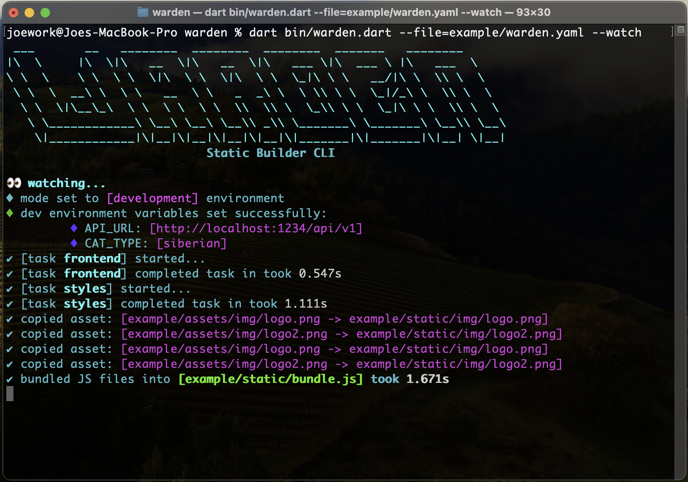

<div align="center">
	
</div>


[  ](https://github.com/joegasewicz/warden/actions/workflows/dart.yml)


**Static builder & bundler for Dart projects**. Inspired by Webpack.

Warden is a lightweight CLI tool to watch and compile Dart and Sass files for frontend projects that don’t use Flutter, are focused on building to JavaScript for server-side rendered apps, and work with Node-installed packages. It’s ideal for projects that still want custom JS/CSS assets compiled automatically.

📚 Docs: [pub.dev/packages/warden](https://pub.dev/packages/warden)

---

## ✨ Features

- 🔁 Watches your Dart and Sass files and recompiles on change  
- 📦 Moves specified dependencies (e.g. node_modules assets) into your build output  
- 🗂️ Moves specified asset directories (e.g. `assets/img/`) into your build output  
- 🛠️ Bundles your dependency JS files into a single `bundle.js` (optional)  
- 🧱 Fully configurable via a `warden.yaml` file  
- 🎯 Supports multiple tasks like compiling Dart to JS and Sass to CSS  
- 🧪 **Debug mode logging** to see every file operation and build step  
- 🚀 **Production mode** for optimised builds with minified output  

---


---

### 📦 Installation

```bash
dart pub global activate warden
```
Then run:
```bash
warden --file=warden.yaml
```
---

### ▶️ Running
Run Warden in **watch mode**:
```bash

warden --watch
# Or define the file path is not in the project root.
warden --file=warden.yaml --watch
```
Or for a one-off build:
```bash
warden --build
# Or define the file path is not in the project root.
warden --file=warden.yaml --build
```
**Debug mode** (development) will show verbose file change and build logs.  
Switch to **production** to build optimised/minified JS and CSS.
```bash
dart run warden --file=warden.yaml --watch --debug
```
---

## ⚙️ Setup

Create a `warden.yaml` in your project root:

```yaml
# ==============================
# Warden Configuration
# ==============================

# The root directory of your source files
source_dir: example

# The environment mode to run in (choose 'development' or 'production')
# 🧪 development → Local dev settings, debug logging enabled
# 🚀 production  → Live site settings, minified builds
mode: development # Default is development

# Where to output built files (JavaScript, CSS, etc.)
destination: example/static/

# Main Dart-built JS file (output location)
main_file: example/static/main.js

# ==============================
# Dependencies
# ==============================
dependencies:
  - source: example/node_modules
    bundle: true
    files:
      - "poppyjs/dist/Poppy.min.js"
      - "bootstrap/dist/js/bootstrap.min.js"
      - "bootstrap/scss/bootstrap.scss"

# ==============================
# Static Assets
# ==============================
assets:
  source: example/assets
  directories:
    - img  # Copies `example/assets/img` → `example/static/img`

# ==============================
# Build Tasks
# ==============================
tasks:
  frontend:
    executable: dart
    args: ["compile", "js", "bin/main.dart", "-O4", "-o", "static/main.js"]
    src: example

  styles:
    executable: dart
    args: ["run", "sass", "sass/index.scss:static/index.css"]
    src: example
    warnings: false

# ==============================
# Environment Variables
# These are injected at compile time for Dart
# ==============================
environment:
  dev:
    API_URL: "http://localhost:1234/api/v1"
    CAT_TYPE: "siberian"
    DEBUG_MODE: "true"
  prod:
    API_URL: "https://www.google.com"
    DEBUG_MODE: "false"
```

---

### 🧪 Example Project Structure
```
examples/
├── bin/
│   └── main.dart
├── lib/
│   └── examples.dart
├── sass/
│   └── index.scss
├── node_modules/
├── warden.yaml
```

---

**Contributions**  
Please open an issue or reply to an existing issue requesting that you would like
to work on it. PRs that do not fix a known bug or add new features will be closed.

**License**  
MIT © 2025 joegasewicz