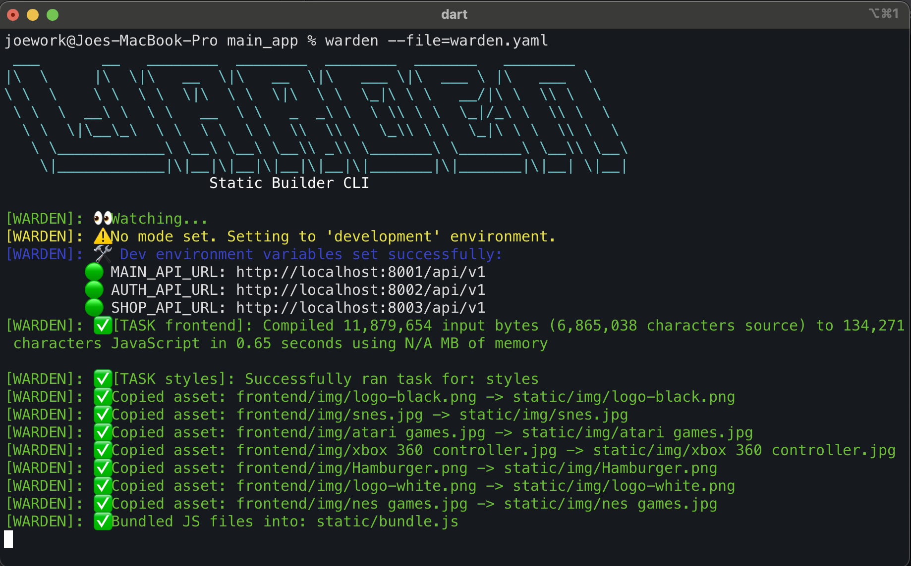

<div align="center">
	
</div>

**Static builder & bundler for Dart projects**

Warden is a lightweight CLI tool to watch and compile Dart and Sass files for frontend projects that don’t use Flutter, are focused on building to JavaScript for server-side rendered apps, and work with Node-installed packages. It’s ideal for projects that still want custom JS/CSS assets compiled automatically.

📚 Docs: [pub.dev/packages/warden](https://pub.dev/packages/warden)

---

## ✨ Features

- 🔁 Watches your Dart and Sass files and recompiles on change  
- 📦 Moves specified dependencies (e.g. node_modules assets) into your build output 
- 🗂️ Moves specified asset directories (e.g. `assets/img/`) into your build output 
- 🛠️ Bundles your dependency JS files into a single `bundle.js` (optional)  
- 🧱 Fully configurable via a `warden.yaml` file  
- 🎯 Supports multiple tasks like compiling Dart to JS and Sass to CSS

---



---

## ⚙️ Setup

Create a `warden.yaml` in your project root:

```yaml
# ==============================
# Warden Configuration
# ==============================

# The root directory of your source files
source_dir: example

# The environment mode to run in (choose 'development' or 'production')
# 🧪 development → local dev settings
# 🚀 production  → live site settings
mode: development (default is set to development)

# Where to output built files (JavaScript, CSS, etc.)
destination: example/static/

# Main Dart-built JS file (output location)
main_file: example/static/main.js

# ==============================
# Dependencies
# ==============================
dependencies:
  # Example: Node modules
  - source: example/node_modules
    bundle: true
    files:
      - "poppyjs/dist/Poppy.min.js"
      - "bootstrap/dist/js/bootstrap.min.js"
      - "bootstrap/scss/bootstrap.scss"

  # Example: Another library folder
  - source: example/another
    bundle: true
    files:
      - "lib1/dep1.js"
      - "lib2/dep2.js"

# ==============================
# Static Assets
# ==============================
assets:
  # The root folder for static assets like images
  source: example/assets
  directories:
    - img  # Copies `example/assets/img` → `example/static/img`

# ==============================
# Build Tasks
# ==============================
tasks:
  # 🧪 / 🚀 Dart frontend compilation
  frontend:
    executable: dart
    # -O4 → optimised build
    # -o  → output location
    # (Warden injects environment variables here via --define for Dart)
    args: ["compile", "js", "bin/main.dart", "-O4", "-o", "static/main.js"]
    src: example

  # Sass/CSS build
  styles:
    executable: dart
    args: ["run", "sass", "sass/index.scss:static/index.css"]
    src: example
    warnings: false # Optional: suppress warnings

# ==============================
# Environment Variables
# These are injected at compile time for Dart
# Access in Dart using:
#   const apiUrl = String.fromEnvironment('API_URL');
# ==============================
environment:
  dev:
    API_URL: "http://localhost:1234/api/v1"
    CAT_TYPE: "siberian"
  prod:
    API_URL: "https://wwww.google.com"

```

### ▶️ Running
Run Warden from your terminal in watch mode:
```
dart run warden --file=warden.yaml
```
This will:
	•	Move files listed in dependencies.files into the output directory
	•	Bundle them into a single bundle.js if bundle: true
	•	Compile Dart to JS
	•	Compile Sass to CSS
	•	Watch and recompile on file changes

### 📦 Installation

```bash
dart pub global activate warden
```
Then run from any Dart project:
```bash
warden --file=warden.yaml
```

### 🧪 Example Project Structure
```
examples/
├── bin/
│   └── main.dart
├── lib/
│   └── examples.dart
├── sass/
│   └── index.scss
├── node_modules/
├── warden.yaml
```

### Contributions
Please open an issue or reply to an existing issue requesting that you would like
to work on it. PRs that do not fix a known bug or add new features will be closed.

License

MIT © 2025 joegasewicz