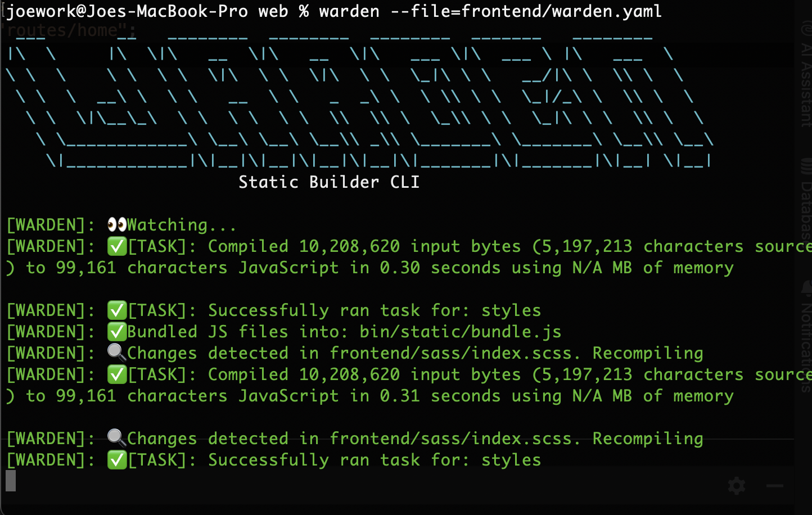

<div align="center">
	
</div>

**Static builder & bundler for Dart projects**

Warden is a lightweight CLI tool to watch and compile Dart and Sass files for frontend projects that don’t use Flutter, are focused on building to JavaScript for server-side rendered apps, and work with Node-installed packages. It’s ideal for projects that still want custom JS/CSS assets compiled automatically.

📚 Docs: [pub.dev/packages/warden](https://pub.dev/packages/warden)

---

## ✨ Features

- 🔁 Watches your Dart and Sass files and recompiles on change  
- 📦 Moves specified dependencies (e.g. node_modules assets) into your build output  
- 🛠️ Bundles your dependency JS files into a single `bundle.js` (optional)  
- 🧱 Fully configurable via a `warden.yaml` file  
- 🎯 Supports multiple tasks like compiling Dart to JS and Sass to CSS



---

## ⚙️ Setup

Create a `warden.yaml` in your project root:

```yaml
# The root directory of your source files
source_dir: examples

# Where to output built files (JavaScript, CSS, etc.)
destination: static/

# Dependency handling (e.g. node_modules)
dependencies:
  source: examples/node_modules
  bundle: true                      # (Optional) Bundle all files into a single bundle.js
  main: static/main.js              # (Optional) Dart-built JS to append to the bundle
  files:
    - 'poppyjs/dist/Poppy.min.js'
    - 'bootstrap/dist/js/bootstrap.min.js'

# Tasks to run (like build steps)
tasks:
  frontend:
    executable: dart
    args: ["compile", "js", "bin/main.dart", "-o", "../static/main.js"]
    src: examples # Working directory for Dart files

  styles:
    executable: dart 
    args: ["run", "sass", "sass/index.scss:../static/index.css"]
    src: examples # Working directory for Sass
    warnings: false # Optional: suppress warnings for this task (default is true)
```

### ▶️ Running
Run Warden from your terminal in watch mode:
```
dart run warden --file=warden.yaml
```
This will:
	•	Move files listed in dependencies.files into the output directory
	•	Bundle them into a single bundle.js if bundle: true
	•	Compile Dart to JS
	•	Compile Sass to CSS
	•	Watch and recompile on file changes

### 📦 Installation (coming soon)

```bash
dart pub global activate warden
```
Then run from any Dart project:
```bash
warden --file=warden.yaml
```

### 🧪 Example Project Structure
```
examples/
├── bin/
│   └── main.dart
├── lib/
│   └── examples.dart
├── sass/
│   └── index.scss
├── node_modules/
├── warden.yaml
```

License

MIT © 2025 joegasewicz